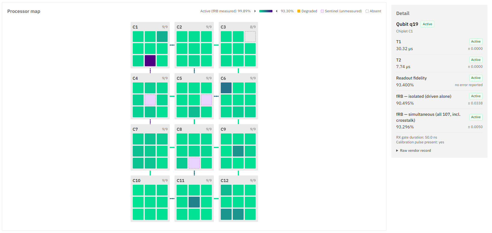
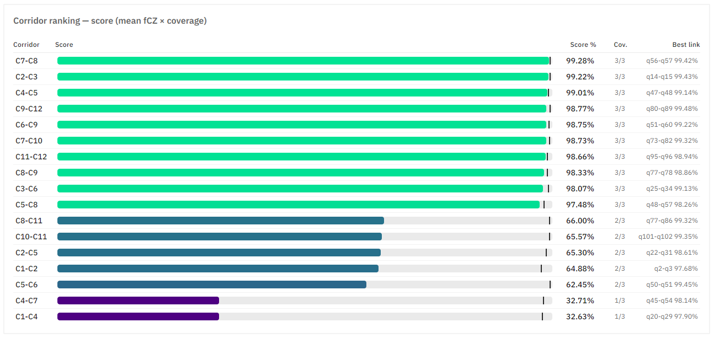
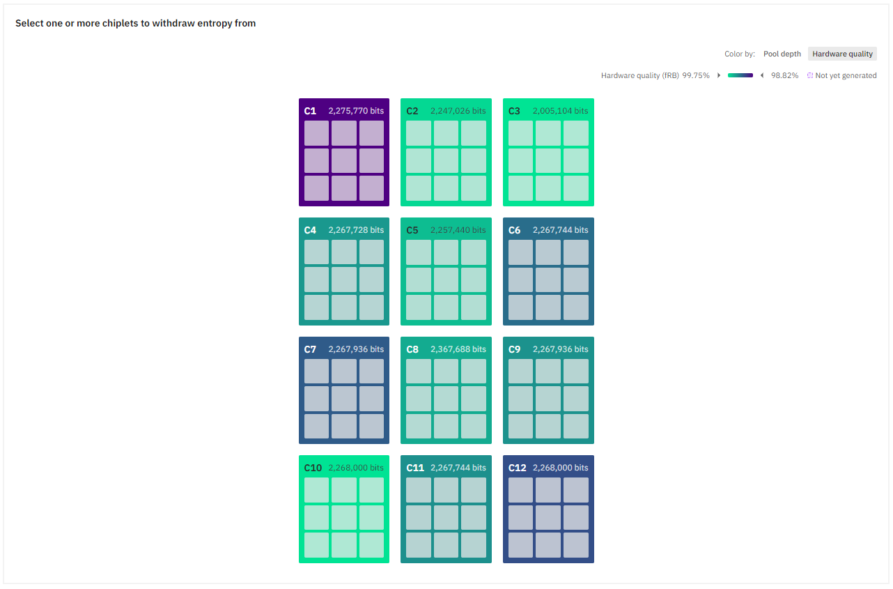

# Rigetti Cepheus-1-108Q

Cepheus-1-108Q is Rigetti's modular superconducting processor and the only Rigetti device currently wired up for job submission on the platform. Where most QPUs on the catalog are a single monolithic qubit array, Cepheus is built from twelve independent 3×3 **chiplets** ("C1"–"C12") linked by a smaller number of inter-chiplet **corridors**.

Open it from the [Backends catalog](/platform/backends/catalog) or directly at `/backends/rigetti-cepheus-1-108q`. The page is organized into five tabs: **Details**, **Topology & Calibration**, **Connection**, **Experiments**, and **Reservation**.

::: tip Reserved access
Unlike the IQM backends on the platform, Cepheus only accepts job submissions during a reservation window you've booked in advance. The Connection tab explains this and links straight to the Reservation tab; see [Connection](#connection) and [Reservation](#reservation) below.
:::

## The measurements

The Topology & Calibration tab (and the spec grid on Details) surface a handful of calibration quantities pulled from Rigetti. Approximate reference values, current as of recent Cepheus calibration data:

| Term | Full name | What it means | Typical Cepheus value |
| --- | --- | --- | --- |
| T1 | Relaxation time | How long a qubit stays in \|1⟩ before decaying to \|0⟩. Longer is better. | ~41 µs |
| T2 | Dephasing time | How long a qubit keeps its phase — the property that makes superposition useful. Always ≤ 2·T1, usually much shorter. | ~12 µs |
| fRB | Randomized benchmarking fidelity | How good a single-qubit gate is: run long random gate sequences that should return to the start, see how often they don't. | ~0.998 |
| fRO | Readout fidelity | How often measurement reports the right answer. 0.5 would be a coin flip. | 0.541 – 0.990 |
| fCZ | CZ gate fidelity | How good the two-qubit gate is on a given coupler — the hardest thing to do well. | ~0.99 – 0.994 |
| error | Error bar | Uncertainty on the measurement. Smaller means more confident. | varies per metric |

Every measurement except T1 and T2 is a fidelity, where 1.0 is perfect and the interesting digits are the ones after the third decimal. fRB comes in two flavors: **isolated** drives one qubit while everything else stays quiet, and **simultaneous** drives all qubits at once, so it picks up crosstalk from neighbors. Simultaneous is the more realistic number for real circuits, and it's what colors the processor map. fRB describes a single qubit; fCZ describes a pair — easy to mix up since both are gate fidelities.

Actual per-qubit and per-coupler values live-update on the Topology & Calibration tab and will differ from the table above at any given moment — treat this table as a reference for what the numbers mean, not a live reading.

## The hardware

| Term | What it means |
| --- | --- |
| Transmon | The physical qubit — a superconducting circuit on the chip. |
| Coupler / edge | The physical connection between two qubits that lets them run a CZ gate. |
| Chiplet | One 9-site silicon die; Cepheus is twelve of them, arranged 3×4. |
| Corridor | The couplers joining two neighboring chiplets. A full corridor has 3 links. |
| Coverage | Fraction of a corridor's 3 links that are actually measured (e.g., 2 of 3 → 0.67). |
| QPU | The processor itself. |
| QCS | Rigetti Quantum Cloud Services — the API the platform pulls calibration and job data from. |

Cepheus's nominal name reflects a 12 × 9 = 108-site design, but the live device typically exposes 107 controllable qubits: one chiplet is missing a site (readout-provisioned but drive-absent). Of the roughly 193 couplers on the chip, most sit inside a single chiplet; the remainder form 17 corridors connecting neighboring chiplets.

## The software layer

| Term | What it means |
| --- | --- |
| ISA | The chip's self-description: which qubits exist, what's connected, how good each one is. |
| Quil | Rigetti's circuit language — gates and measurements. |
| Quil-T | Quil extended down to pulses and timing. |
| quilc | The compiler that turns a circuit into gates the chip natively supports. |
| QVM | Rigetti's simulator. Doesn't run Quil-T. |
| pyquil | The Python SDK Rigetti's stack is built on. |
| DEFCAL | A pulse definition for a gate — "when you see CZ on q45 q54, play this." |
| DEFFRAME | A named output channel: one qubit's drive line, readout line, or coupler line. |
| DEFWAVEFORM | A pulse shape. |
| Sentinel | Rigetti's "not measured" placeholder value (0.5 fidelity, error 1.0) — never a real reading. |
| calibration_id | A fingerprint identifying one hardware calibration snapshot. |

## Details

The Details tab shows the same spec fields as the backend's card in the catalog-wide modal. Depending on what the live ISA response populates, you'll see: status, type (QPU), qubit count, provider, backend ID, topology family, native gate list, and median values for one- and two-qubit gate fidelity, readout fidelity, T1, and T2. All of these are computed fresh from Rigetti's ISA on every page load rather than cached or hardcoded.

The status badge reflects whether the ISA endpoint responded successfully, not live hardware uptime in the operational sense. A reachable endpoint is shown as online.

## Topology & Calibration

Full per-qubit and per-coupler visibility into Cepheus. Viewing the live data requires being logged in.

**Stat strip.** Five summary tiles across the top:

- **Best corridor**: the top-ranked corridor by score.
- **Best coupler**: the single highest-fidelity CZ pair on the chip, which is deliberately a different metric than "best corridor": a corridor's score already accounts for coverage, so the corridor with the single best link isn't necessarily the best corridor overall.
- **Calibration**: how old Rigetti's calibration snapshot is, plus a truncated calibration ID.
- **Last poll**: when Light Rider's own poller last pulled fresh data, kept separate from the calibration age above because a stalled poller and a healthy one look identical if you only check calibration age.
- **Provenance**: whether the topology (which qubits connect to which) is vendor-confirmed or inferred.

**Processor map.** All twelve chiplets, laid out 3 columns by 4 rows, each showing its qubits as a 3×3 sub-grid. Corridor lines are drawn between chiplets, with thickness scaled by coverage and color scaled by score; a dashed line marks a corridor with incomplete coverage. Qubit cells are colored by simultaneous fRB error rate on a continuous gradient, with fixed colors for degraded, sentinel (unmeasured), and absent qubits. Clicking any chiplet, qubit, or corridor populates the detail panel on the right; hovering shows a quick tooltip.

**Corridor ranking.** A table of every corridor, scored as mean CZ fidelity × coverage, so a corridor with one great link and two unmeasured ones doesn't outrank one with three solid links. Corridors with no measured links yet are broken out separately and labeled "not measured".

**Detail panel.** Selecting a qubit shows T1, T2, readout fidelity, isolated and simultaneous fRB, gate duration, and a raw-vendor-record expander. Selecting a coupler shows CZ fidelity and duration plus which corridor (if any) it belongs to. Selecting a corridor shows coverage, mean and best-link fidelity, and its constituent couplers. Throughout, a sentinel value (0.5 fidelity, error 1.0) is always labeled "uncharacterized" rather than displayed as a real number. This is Rigetti's own marker for "not yet measured," not a bad result.

*Topology & Calibration tab, processor map and qubit detail panel. Captured September 16, 2026 (Rigetti calibration ID `5d04f1ba`). Per-qubit and per-corridor values refresh on every visit and will differ from this snapshot later.*

*Corridor ranking table, showing all 17 corridors sorted by score (mean fCZ × coverage), with the corridor's best individual link alongside. Captured September 16, 2026, from the same calibration snapshot as above.*

## Connection

The Connection tab is where you generate a runnable code snippet or submit a sample circuit (shared UI with the rest of the catalog). Because Cepheus is reservation-gated, submitting a job here only works during an active reservation window. If you have an API key but no reservation running right now, the primary action is **Book a reservation**, which jumps to the Reservation tab. Once a reservation is active, the tab shows the usual Python snippet (installs the `lightrider` SDK, builds a sample circuit, and posts it with your API key) and a Google Colab quickstart notebook, plus a **Submit a sample circuit** button that opens the same submission modal used elsewhere on the platform.

Submitting a real job requires a Light Rider API key (Settings → API Keys) and having purchased compute credits at least once; the free `:mock` simulator counterpart needs neither.

## Experiments

Experiments are backend-specific use cases meant to showcase what a device's particular topology is good for. Cepheus currently has one built out: **Quantum Entropy**, a random-bit-generation experiment built directly around the chiplet layout.

Quantum Entropy has two modes.
- **From pool**: withdraws pre-generated random bits instantly from each chiplet's inventory: pick one or more of the twelve chiplets on a visual picker (the same chiplet/qubit visuals as the Topology tab), choose a bits-per-chiplet preset (16 up to 256, or a custom amount), optionally combine multiple chiplets' output into one XOR'd stream, and withdraw. The picker can color chiplets either by remaining pool depth or by hardware quality (live fRB data pulled from the same source as the Topology tab).
- **Live measurement**: generating entropy from a fresh circuit run rather than a pre-filled pool (Coming soon).

Withdrawals are metered in compute credits.

*Chiplet picker in "From pool" mode, colored by hardware quality, with all twelve chiplets and their current available-bits counts. Captured September 16, 2026.*

## Reservation

Cepheus is the only backend on the platform that requires a reservation to submit jobs, and this tab is where you manage that:

- **My reservations**: your own active, upcoming, and past reservations. An active reservation links straight to the submission modal for that window. Reservations shown here can't be canceled once booked, since Rigetti's cancellation billing isn't yet supported.
- **Book a slot**: choose a 15, 30, or 60-minute window (30 and 60 are built from consecutive 15-minute blocks), see a live price preview in credits, then pick an exact time on a calendar of available slots. Confirming a booking is final and charges your credit balance immediately.

## Next steps

- [Backends catalog](/platform/backends/catalog) — where Cepheus and other processors are listed, and how job submission works generally.
- [Cepheus Chiplets as Logical Qubits](/platform/backends/cepheus-logical-qubits) — Light Rider's QEC architecture built on top of Cepheus's chiplet layout.
- [QEC Module Design & Selection](/platform/backends/cepheus-qec-modules) — the module-selection API underneath that architecture.
- [Jobs & results](/platform/jobs) — track submissions made from the Connection tab and read measurement results.
