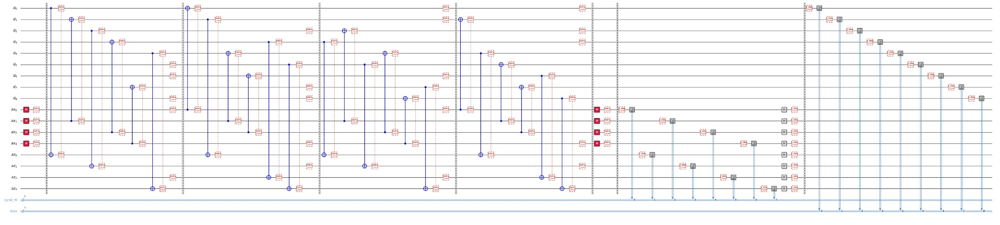
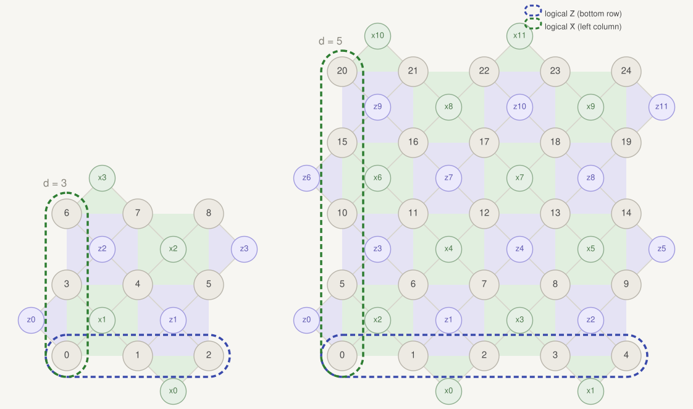
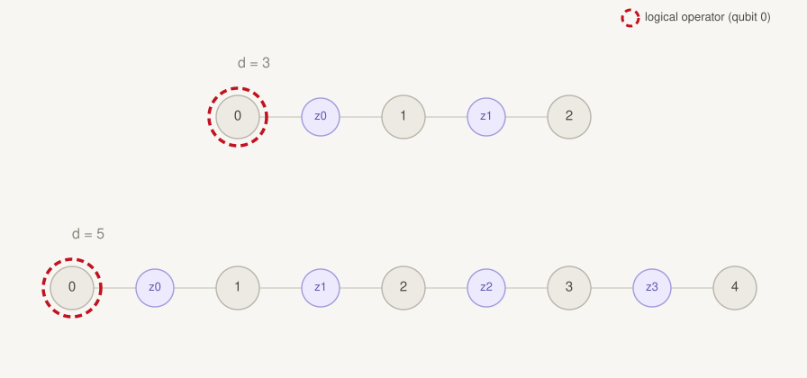
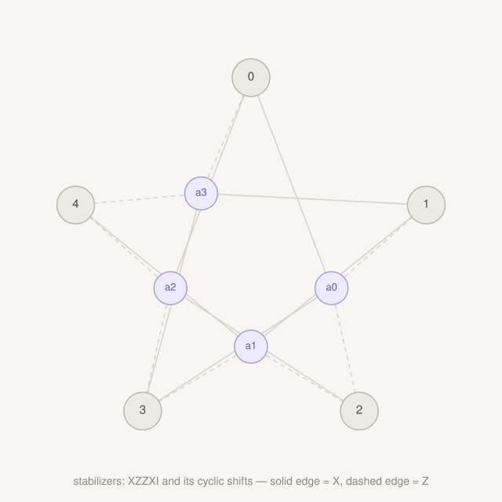
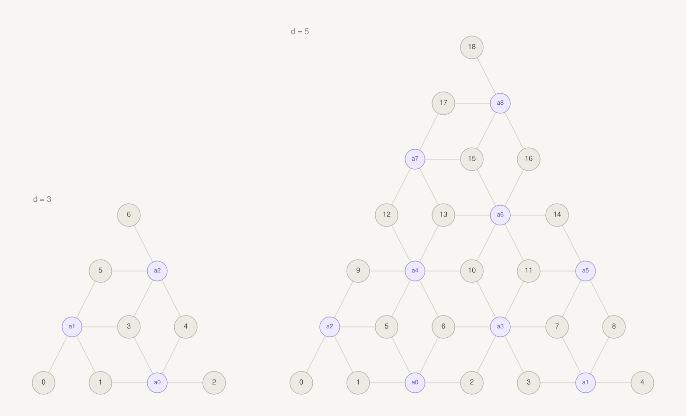
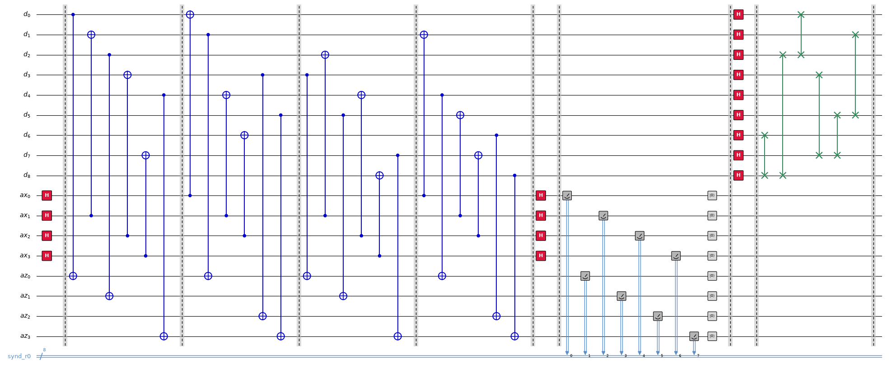

# Quantum Error Correction with `lightrider`

An introduction to running circuit-level QEC experiments with the `lightrider` SDK: building encoded circuits for several stabilizer codes, injecting noise, simulating on the local stabilizer backend, and decoding with PyMatching to measure logical fidelity before and after correction.

## Installation

```bash
pip install lightrider pymatching
```

`pymatching` is required for the MWPM decoding used by `build_matching()` and `logical_fidelity()`.

## The QEC test workflow

Every code class follows the same five-step pattern:

```python
from lightrider import RotatedSurface_Code, inject_sc_noise, draw_circuit, get_backend
```

**1. Build the code and its QEC-test circuit** (prepare logical `|0>`, run syndrome rounds, measure all data qubits):

```python
RScode = RotatedSurface_Code(distance=3, rounds=1)
RScirc = RScode.build_circuit_QECtest()
```

**2. Inject circuit-level Pauli noise** at physical error rate `p`:

```python
p = 1e-4
noisy_RScirc = inject_sc_noise(RScirc, p=p)
```

**3. (Optional) visualize the circuit:**

```python
draw_circuit(noisy_RScirc.to_text(), save_path="out.png")
```

Example result (d=3 rotated surface code, 1 round):



**4. Simulate on the local stabilizer backend:**

```python
result = get_backend('stabilizer').run(noisy_RScirc, shots=20000).result()
shots = RScode.counts_to_shots(result.counts)
```

**5. Decode and compare logical fidelity** with and without correction:

```python
res = RScode.logical_fidelity(shots, 'Z', p=p)   # MWPM via pymatching
print(f"Raw Fidelity: {res['fidelity_before']:.6f} (err {res['error_before']:.2e})")
print(f"QEC Fidelity: {res['fidelity_after']:.6f} (err {res['error_after']:.2e})")
```

Typical output (d=3 rotated surface code, p=1e-4, 20k shots):

```
Raw Fidelity: 0.997250 (err 2.75e-03)
QEC Fidelity: 0.998800 (err 1.20e-03)
```

`logical_fidelity()` returns a dict with `fidelity_before` / `error_before` (raw logical readout, no decoding) and `fidelity_after` / `error_after` (after XORing in the decoder's predicted logical flip). "Fidelity" here is the logical bit fidelity, `1 - logical error rate`.

## Available codes

### Rotated surface code

```python
from lightrider import RotatedSurface_Code

RScode = RotatedSurface_Code(distance=3, rounds=1)
res = RScode.logical_fidelity(shots, 'Z', p=p)    # basis: 'Z' or 'X'
```

The `[[d^2, 1, d]]` rotated surface code. Decoded with MWPM on the multi-round matching graph; a virtual final round is reconstructed from the data-qubit readout (the standard boundary trick for memory experiments).



### Repetition code

```python
from lightrider import Repetition_Code

Repcode = Repetition_Code(n=3, rounds=1)
res = Repcode.logical_fidelity(shots, p=p)
```

Bit-flip repetition code — the simplest matchable code, useful as a sanity check.



### Five-qubit code

```python
from lightrider import FiveQubit_Code

FQcode = FiveQubit_Code(rounds=1)
res = FQcode.logical_fidelity(shots, expected=0)
```

The perfect `[[5,1,3]]` code. Its errors flip more than two stabilizers, so it is not decodable by plain matching — decoding is handled internally (no `p`/`matching` argument).



### 6-6-6 color code

```python
from lightrider import Color_Code

Colcode = Color_Code(distance=3, rounds=1)
res = Colcode.logical_fidelity(shots, p=p)
```

Triangular 6-6-6 color code, decoded with a restriction decoder: three color-restricted matching subgraphs whose corrections are combined. Note the round-count constraint — fidelity readout needs a deterministic logical-Z observable, which occurs when `rounds % 3 == 2` (rounds = 2, 5, 8, ...; at least one Z-type syndrome round is also needed, so rounds >= 5 in practice).

Only `distance=3` is available on real QPU hardware (with 4 connections per qubit); `distance > 3` (e.g. d=5) can only be run on the local `'stabilizer'` simulator backend.



## Building custom circuits (logical gates between rounds)

Instead of `build_circuit_QECtest()`, you can assemble the circuit round by round and insert logical operations, e.g. a transversal logical Hadamard between two blocks of syndrome extraction:

```python
RScodeH = RotatedSurface_Code(distance=3, rounds=1)
RScodeH.circ = lightrider.Circuit(RScodeH.total_qubits, RScodeH.total_clbits, name="surf_test")
for i in range(1):
    RScodeH.syndrome_round(i)
RScodeH.logical_H()
draw_circuit(RScodeH.circ.to_text(), save_path="RS_LH.png")
```

Example result (d=3 rotated surface code, 1 round, followed by a transversal logical H):



Available logical gates:

| Logical gate | Effect |
|---|---|
| `logical_X()` | Transversal logical Pauli-X: flips the encoded qubit's Z-basis readout, applied as physical `x` gates across the logical-X operator's support. |
| `logical_Y()` | Transversal logical Pauli-Y: composition of `logical_X()` and `logical_Z()`; flips the readout in both bases. |
| `logical_Z()` | Transversal logical Pauli-Z: flips the encoded qubit's X-basis readout, applied as physical `z` gates across the logical-Z operator's support. |
| `logical_H()` | Transversal logical Hadamard: swaps the roles of the X and Z stabilizers, and of the logical X/Z operators. |
| `logical_S()` | Logical phase gate: maps the logical X operator to Y (and Y to −X). **Not** transversal for CSS codes like the surface code — currently only implemented for the repetition code, as decode → single physical `s` → re-encode. |

`logical_X()` / `logical_Y()` / `logical_Z()` / `logical_H()` are transversal (one physical gate per qubit in the relevant operator's support) and are tracked by the class so `logical_support()` stays correct afterward. `logical_H()` is the odd one out among these four — it also swaps which physical stabilizers are "X-type" and "Z-type" for every later round, whereas the Pauli gates leave the stabilizer frame unchanged. Because the decoder helpers assume a single stabilizer frame across all rounds, decoding a history that spans a `logical_H()` call needs separate treatment for the rounds before and after the swap.

`logical_S()` has no transversal implementation on CSS codes (the S gate is not a stabilizer automorphism for the surface or color code), so it is currently only supported for the repetition code, where it is realized by decoding to the logical qubit, applying a single physical `s`, then re-encoding — not a fault-tolerant transversal operation.

## Using a different decoder

`build_matching()` / `logical_fidelity()` are PyMatching-specific conveniences. To plug in any other decoder (fusion-blossom, BP-OSD, a custom matcher), export the decoding problem as plain matrices:

```python
problem = RScode.decoding_problem('Z', p=p)
problem['check_matrix']        # (num_detectors x num_faults) sparse GF(2) matrix
problem['observable_matrix']   # (1 x num_faults): which faults flip the logical
problem['weights']             # log((1-p)/p) edge weights
problem['num_detectors'], problem['num_rounds']
```

Per-shot detector vectors to feed such a decoder come from:

```python
dets = RScode.extract_detectors(single_shot_clbits, 'Z')
```

Detectors are XORs of consecutive syndrome rounds (plus the virtual final round for `'Z'`), so they fire only when an error occurs — the right input for any syndrome decoder.

## Practical tips

- Restart your kernel after (re)installing the package; imports are cached per session.
- At low `p` the error rates are small — 20k shots gives only a handful of error events. Use 1e5–1e6 shots (or a larger `p`) for statistically meaningful before/after comparisons.
- Expect `error_after` well below `error_before` for matchable codes at low `p`; if they're equal, check that `shots`, the matching, and the code instance all come from the same `distance`/`rounds` configuration.
- All simulation here runs locally on the `'stabilizer'` backend (Clifford-only, scales to hundreds of qubits). The same circuits can be submitted to IQM hardware via `get_backend('iqm', ...)`.


